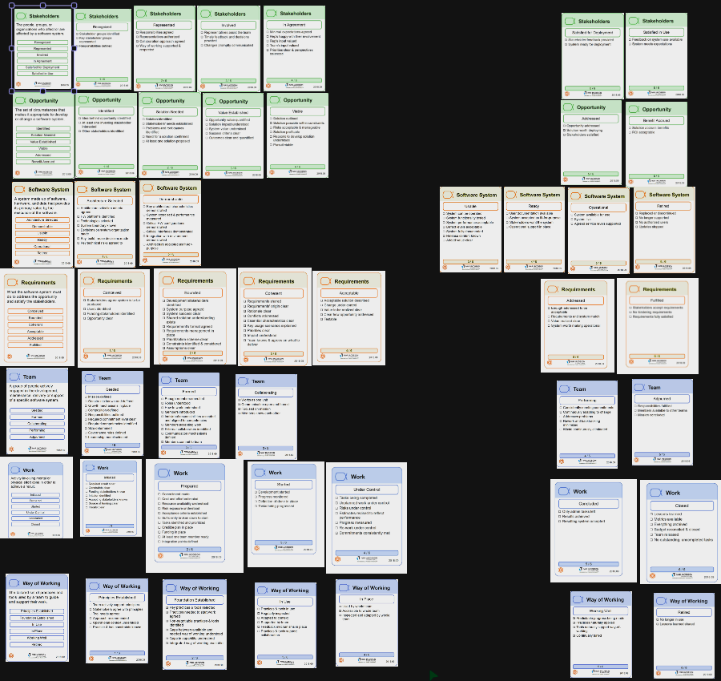
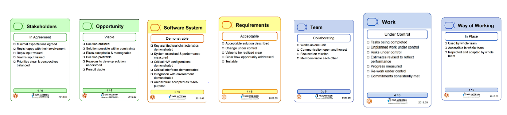

###Introduzione:

Lo Scrum Master ha spiegato le modalità della retrospective, in particolare cos’è Essence, da cosa è composto ( kernel, alpha, etc… ) e i 7 giochi per il supporto del team.
Abbiamo poi discusso in generale sullo sprint, sugli obiettivi e sui cambiamenti e miglioramenti effettuati e da effettuare.
Dopodichè abbiamo giocato a Progress Poker, Chase the State e Good, Mad, Sad per finire la retrospettiva.

###Progress Poker + Chase the State + Good, Mad, Sad:

Stakeholders:
	Petru: Vota 4
	Saad: Vota 4
	Alex: Vota 4
	Rafid: Vota 4
	Giuseppe: Vota 4
	Donati: Vota 4

	CONSENSO FINALE: 4

Opportunity:
	Petru: Vota 4
	Saad: Vota 4 -> Non avendo ancora finito non possiamo dire che vale la pena implementare la soluzione e che lo stakeholder sia soddisfatto
	Alex: Vota 4
	Rafid: Vota 5
	Giuseppe: Vota 5 -> Nonostante non abbiamo ancora finito, quello che dobbiamo fare è abbastanza chiaro
	Donati: Vota 5
	
	CONSENSO FINALE: 4

Software System:
	Petru: Vota 2
	Saad: Vota 2
	Alex: Vota 2
	Rafid: Vota 2
	Giuseppe: Vota 2
	Donati: Vota 2

	CONSENSO FINALE: 2

Requirements:
	Petru: Vota 4
	Saad: Vota 4
	Alex: Vota 3 -> non è completamente testabile
	Rafid: Vota 3
	Giuseppe: Vota 4
	Donati: Vota 4

	CONSENSO FINALE: 4
Team:
	Petru: Vota 3
	Saad: Vota 3
	Alex: Vota 3
	Rafid: Vota 3
	Giuseppe: Vota 3
	Donati: Vota 3

	CONSENSO FINALE: 3

Work:
	Petru: Vota 3 - impegni non sempre mantenuti con costanza
	Saad: Vota 4
	Alex: Vota 4
	Rafid: Vota 3
	Giuseppe: Vota 4
	Donati: Vota 4

	CONSENSO FINALE: 4

Way of Working:
	Petru: Vota 5
	Saad: Vota 5 - sono state esplicitate le modalità di lavoro e vengono eseguite perfettamente
	Alex: Vota 4
	Rafid: Vota 4
 	Giuseppe: Vota 4
	Donati: Vota 2 - mancanza di chiarezza delle pratiche per l’inizio di determinati lavori

	CONSENSO FINALE: 4

###Conclusione:

Sintesi e Pianificazione:
	Durante la valutazione dello sprint, abbiamo identificato alcuni problemi organizzativi legati alle schedule e la necessità di concentrarci maggiormente sulle attività essenziali. 
	Inoltre, stiamo incoraggiando un approccio alla scrittura di codice con una mentalità di testing per migliorare la qualità del nostro lavoro.
Riflessioni sugli Obiettivi:
	Riguardo agli obiettivi da raggiungere, stiamo valutando il nostro progresso nell'implementare la possibilità di giocare online, stabilire collegamenti coi social network, permettere il gioco come mob su Telegram e gestire l'area personale.
	Verrà data importanza al risanamento del debito tecnico e al posizionamento del gioco nel backend da una porzione del team.
	Cerchiamo di identificare le aree in cui abbiamo avuto successo e quelle in cui possiamo migliorare ulteriormente.
Attuazione delle Richieste del PO:
	Per rispondere alle richieste del Product Owner, pianifichiamo il trasferimento delle funzionalità nel backend per tutte le modalità di gioco. Inoltre, stiamo avviando un processo di ottimizzazione dell'interfaccia degli scacchi per renderla non solo funzionale ma anche visivamente attraente.
Riflessioni sulle Scelte Lavorative:
	Esaminando le scelte operative fatte durante lo sprint, riconosciamo l'efficacia della suddivisione del lavoro in gruppi. Questa ha portato alla specializzazione dei membri in determinati ambiti e ad una costanza di flusso di lavoro.
